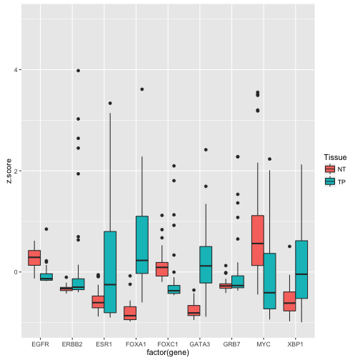

FirebrowseR is an API client for the [firehose pipeline](http://gdac.broadinstitute.org/), provided by [Broadinstitute](https://www.broadinstitute.org/), which generates the most data sets used by the [TCGA](https://tcga-data.nci.nih.gov/tcga/). To access the data provided by the firehose pipeline the Broadinstitute provides several tools. One of these tools is the [Firebrowser](http://firebrowse.org/) which also serves a [Web-API](http://firebrowse.org/api-docs/). This API is queried by this R package, FirebroweR, giving you easy access to genomic data sets.

## Introduction
A short outline about what's in the scope of this package and some brief ideas on how to use it.

### The API itself
The Firebrowse API with all it's functions, features and describtions can be viewed [here](http://firebrowse.org/api-docs/). The API divides into four categories:

1. Samples
    * Gives access to data types which did not receive a functional analysis.
1. Analyses
    * Data sets included here a pre-processed, since the RAW-data would be to big.
1. Archives
    * Allows one to download big compressed archives, including data sets which are to large, even after pre-processing them.
1. Metadata
    * Here one can assess all information needed to design and build cohorts etc..

### Scope of FirebrowseR
This package is designed to give easy access to Firehose/TCGA data sets for R programmers. Therefor it's implementing all functions provided by the Firebrowse API, which lets one comfortable query and download data sets. This package does not provide any additional functions, methods or tools to (pre-)process, analyse or evaluate the data sets named above.

### Getting around
FirebrowseR provides all functions displayed in the [API-Documentation](http://firebrowse.org/api-docs/), having exactly the same names and arguments. Also each function has it's own help page, accessable by `?function_name`, giving explanations and examples needed for this function. Further four additional data frames are provided; namely

* data_types,
    * Needed for: `Metadata.Counts` and `Archives.StandardData`
* tools,
    * Needed for: `Samples.miRSeq`, `Analyses.Mutation.MAF`,
    `Analyses.Mutation.SMG` and `Archives.StandardData`
* protocols and
    * Needed for: `Samples.mRNASeq`, `Archives.StandardData`
* sample.Types.
    * Needed to extract the definitions of _Code_ and _Short.Letter.Code_

serving additional information, which maybe required for some quiries but not provided by the API.

### Installation
The FirebrowseR package installs like every other R package `install.packages('FirebrowseR')` or `devtools::install_github("mariodeng/FirebrowseR")`

### License
FirebrowseR is licensed under MIT License. Please see license file or [wikipedia](https://en.wikipedia.org/wiki/MIT_License).

## How to use
Here we talk and run through some examples, giving you an introduction to this package and discuss the cases in which it differs from the API.

### Example, Breast Cancer mRNA expression
In this first example we are going to analyse mRNA expression data of Breast Cancer. We take a look at some genes which are well known to be differentially expressed.
At first, we have to design our cohort. The method `Metadata.Cohorts` returns all cohort identifiers and their corrosponding description. Within the description we search for "breast", yielding to identifier for breast cancer.

```r
require(FirebrowseR)
cohorts = Metadata.Cohorts() # Download all available cohorts
cancer.Type = cohorts[grep("breast", cohorts$description, ignore.case = T), 1]
print(cancer.Type)
```

```
## [1] "BRCA"
```

Now that we know that the breast cancer samples are identified be `BRCA`, we can retrieve a list of all patients associated with this identifier.

```r
brca.Pats = Samples.ClinicalTier1(cohort = cancer.Type)
dim(brca.Pats)
```

```
## [1] 250  24
```

The code above, looking at the dimensions of the returned data frame, indicates that there are only 250 patients, which does not corrospont the number given at the [firebrose website](http://firebrowse.org/). This is due to the fact, that the firebrowse API returns the data pagewise, with a default page size of 250 entries (this holds for all functions/queries). The global limit for the page size is 2000.
We can resolve this issue by iterating over the pages, until we receive a data frame with less than the page size (250) entries.

```r
all.Received = F
page.Counter = 1
brca.Pats = list()
while(all.Received == F){
  brca.Pats[[page.Counter]] = Samples.ClinicalTier1(cohort = cancer.Type,
                                                    page = page.Counter)
  if(nrow(brca.Pats[[page.Counter]]) < 250)
    all.Received = T
  else
    page.Counter = page.Counter + 1
}
brca.Pats = do.call(rbind, brca.Pats)
dim(brca.Pats)
```

```
## [1] 1070   24
```

Now we got all patients (1070).
Here we reduce the number of patients to the once who died. We only do this to keep the runtime short, downloading mRNA expression data for a thousand patients would take alot of time, later on.

```r
brca.Pats = brca.Pats[ which(brca.Pats$vital_status == 1), ]
```
Here we define a vector containing some genes which are known to be differentially expressed in breast cancer and download the mRNA expression data for these genes and our patients.

```r
diff.Exp.Genes = c("ESR1", "GATA3", "XBP1", "FOXA1", "ERBB2", "GRB7", "EGFR",
                   "FOXC1", "MYC")
all.Found = F
page.Counter = 1
mRNA.Exp = list()
page.Size = 2000 # using a bigger page size is faster
while(all.Found == F){
  mRNA.Exp[[page.Counter]] = Samples.mRNASeq(gene = diff.Exp.Genes,
                                             tcga_participant_barcode =
                                               brca.Pats$tcga_participant_barcode,
                                             page_size = page.Size)
  if(nrow(mRNA.Exp[[page.Counter]]) < page.Size)
    all.Found = T
  else
    page.Counter = page.Counter + 1
}
mRNA.Exp = do.call(rbind, mRNA.Exp)
dim(mRNA.Exp)
```

```
## [1] 1584    8
```

We only keep the samples having a primary tumor and corrosponding normals tissue available. Normal tissue is encoded by `NT` and tumor tissue by `TP`. Some firehose functions require these identifiers or numbers. Since the API does not provide a function to decode the meaning of these identifiers, the data frame `sample.Type` included in this package does.

```r
# Patients with normal tissue
normal.Tissue.Pats = which(mRNA.Exp$sample_type == "NT")
# get the patients barcodes
patient.Barcodes = mRNA.Exp$tcga_participant_barcode[normal.Tissue.Pats] 
# Subset the mRNA.Exp data frame, keeping only the pre-selected barcodes AND
# having a sample type of NT or TP
mRNA.Exp = mRNA.Exp[which(mRNA.Exp$tcga_participant_barcode %in% patient.Barcodes &
                            mRNA.Exp$sample_type %in% c("NT", "TP")), ]
```

Now we can use the famous ggplot2 package to plot the expression.

```r
require(ggplot2)
```

```
## Loading required package: ggplot2
```

```r
p = ggplot(mRNA.Exp, aes(factor(gene), z.score))
p +
  geom_boxplot(aes(fill = factor(sample_type))) +
  # we drop some outlier, so plot looks nicer, this also causes the warning
  scale_y_continuous(limits = c(-1, 5)) +
  scale_fill_discrete(name = "Tissue")
```

```
## Warning in loop_apply(n, do.ply): Removed 59 rows containing non-finite
## values (stat_boxplot).
```

 

##FAQ

### Preamble
Every method in this package returns data, if not please read below. Further, there is no difference when using `tsv` or `csv`, both return a matrix/data frame, both arguments are just implemented to match the API. It is also possible to receive a `json` object (which requires the `jsonlite` package). Which one you use depends; if you prefer working with matrix/data frames or json objects, both have pros and cons when accessing the data.

### No data is returned
If your query did not return any data, then there are potentially four reasons for that.

1. There is no data matching your query
    * Some types of analyses might not be available for each cohort
1. Your arguments are malformed
    * Please visit the [API-Doc](http://firebrowse.org/api-docs/), to verify and test your arguments for the function you are using.
1. The API is too busy to answer
    * Since the API still is beta, there might be some problems with big queries, in special when querying for large data (e.g. expression) for hundreds of patients. Here you might consider further chunking and not only use the page/page_size feature.
1. There is a bug within this function
    * Please directly write a mail or consider posting to [biostars](https://www.biostars.org/) or [stackoverflow](https://stackoverflow.com/). We are following every post tagged with __FirebrowseR__.

